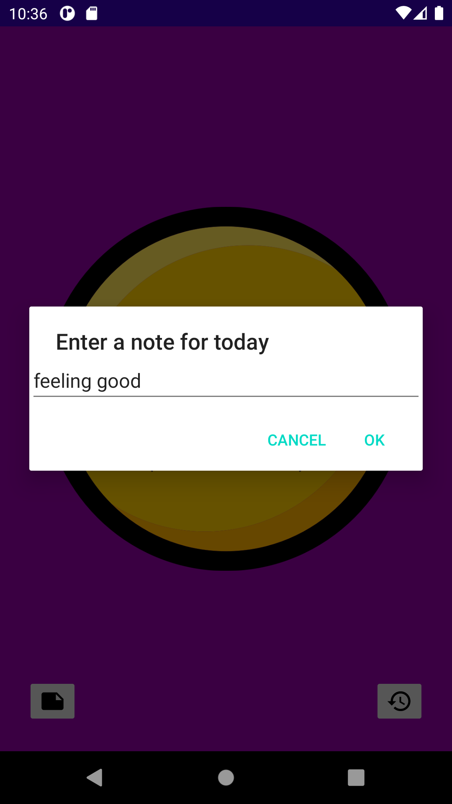
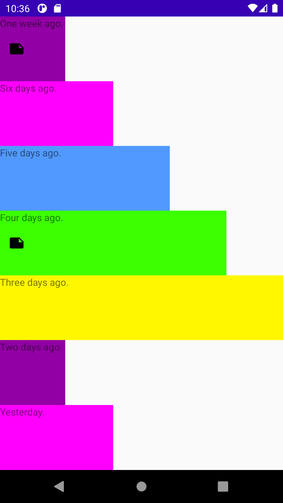

# Open Classrooms Mentor | Mood Journal Android Exercise

This is a reference implementation of the OC Mood Journal project.  The first purpose
follows the "If you are going to teach it, you better have done it" line of thinking.
The second purpose is as a discussion point for the more than one way to implement
this project.

